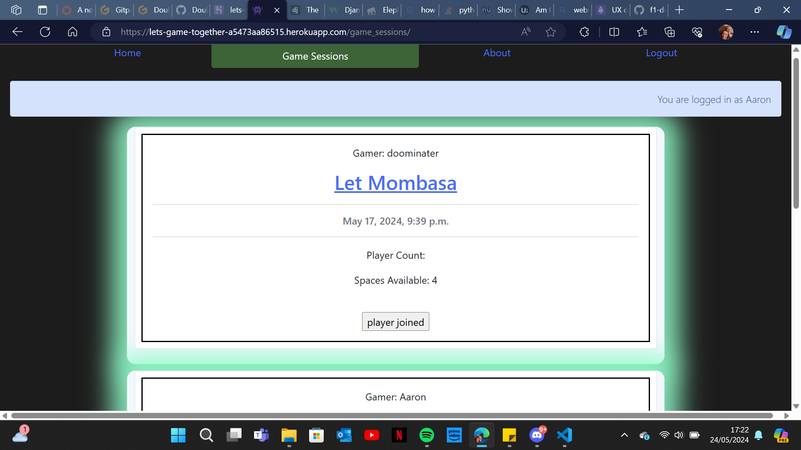
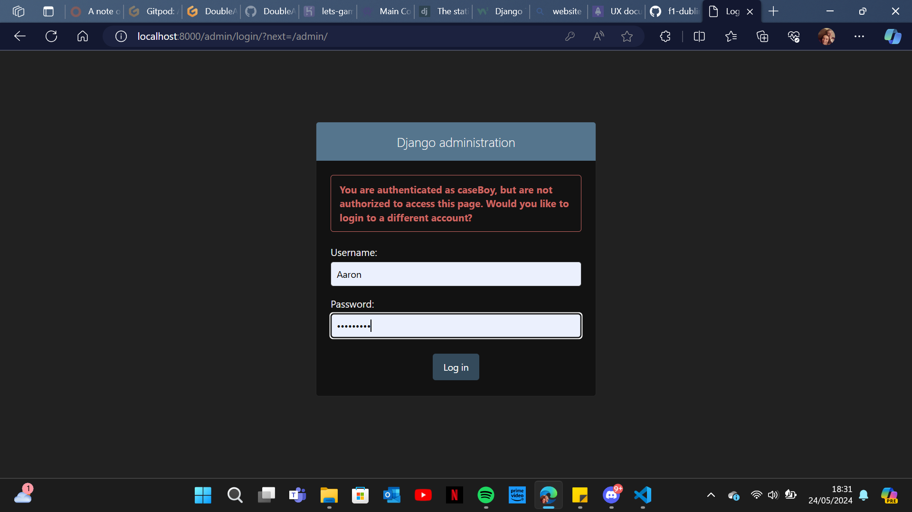
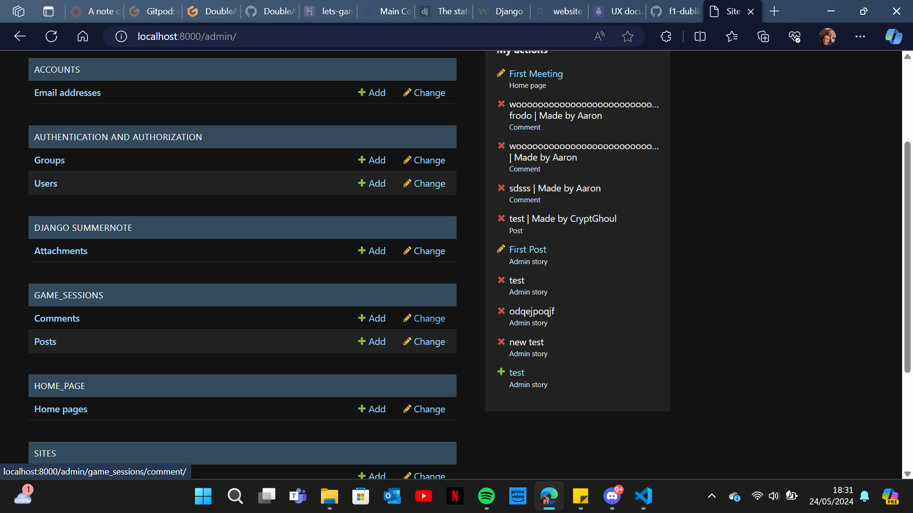

Welcome,

This is the Code Institute student template for Codeanywhere. If you are using Gitpod then you need [this template](https://github.com/Code-Institute-Org/gitpod-full-template) instead.  We have preinstalled all of the tools you need to get started. It's perfectly ok to use this template as the basis for your project submissions.

You can safely delete this README.md file, or change it for your own project. Please do read it at least once, though! It contains some important information about Codeanywhere and the extensions we use. Some of this information has been updated since the video content was created. The last update to this file was: **August 30th, 2023**

## GitPod Reminders

To run a frontend (HTML, CSS, Javascript only) application in Codeanywhere, in the terminal, type:

`python3 -m http.server`

A button should appear to click: _Open Preview_ or _Open Browser_.

To run a frontend (HTML, CSS, Javascript only) application in Codeanywhere with no-cache, you can use this alias for `python3 -m http.server`.

`http_server`

To run a backend Python file, type `python3 app.py`, if your Python file is named `app.py` of course.

A button should appear to click: _Open Preview_ or _Open Browser_.

To log into the Heroku toolbelt CLI:

1. Log in to your Heroku account and go to _Account Settings_ in the menu under your avatar.
2. Scroll down to the _API Key_ and click _Reveal_
3. Copy the key
4. In Codeanywhere, from the terminal, run `heroku_config`
5. Paste in your API key when asked

You can now use the `heroku` CLI program - try running `heroku apps` to confirm it works. This API key is unique and private to you so do not share it. If you accidentally make it public then you can create a new one with _Regenerate API Key_.

---

Happy coding!

### Game Together

## Introduction

# Visit the Website Here

# Visit the Project's GitHub Repository Here

# Responsive Image

# Website Highlights

## UX
the UX is a main part of the site by making it simple and easy to understand parts of the ux are 
* Strategy
* Scope
* Structure
* Skeleton
* Surface

# Strategy

When planning the site I could relate to the group i am aiming to draw in.

so when planning i thought about how i struggle to play groupe games now because all my friends have different hours, so i thought if i could make a site that can be assessed at anytime and responses don't have to be instant.

Target audience :
* 18 to 50 years old 
* people that are working full time and have not a lot of spare time.
* people that like to game in groups 

# Purpose
the purpose of this website it to be able to bring people together in a controlled and monitored way while gaming.
the plan is to make it easier for people like me that don't have much spare time to game and when they do they cant find anyone to play with, so with this i added functions to the site so that admins and superusers can make sessions and only registered people can join for extra protection.

# User Stories

# For the Future
the future i plan to add more interactivity like an voice chat to the sessions the users will be able to post images from games and have a profile with a logo or profile picture.
Scope

## Structure
the structure of the project is a very basic layout so its easy to use and look thorugh the pagesand works with the databse so pages can be updated and changed from the admin page and all questions can be changed and and deleted.
# Project Applications

# Project Databases

this was my origanl plan for the data bases but i have adjusted it to work with the project now. there is three data bases one for the home page welcome message , the game sessions and the about page.

# Accounts 
the accounts are the authentication so users can get around the site and if they dont meet the requirements they wont be able to get around the site.

# Posts/Sessions
within this it will hold the users data that made it and will have players that leave questions in the question part, it will also store the game , the amount of players and a brief description of what the host has planned 

the models can be broken down into

* Post_id - text value for selection 
* Gamer_tag - user name for account
* Datetime - this is to choose the date for the session 
* Game - the game the user is planning to play or other if its not on the list
* Player_count - this is to tells the data base the maximum amount of players
* Updated_on - this records any time the data has been changed
* Slug - the slug was made because i had an issue with the post_id when the comments would link properly
* Joined_status - this is a boolean for join (not currently used)

# Surface
the surface is the look of the page basically the html and css 
# Font
sadly I haven't added a basic font to the website.

# Icons
Icons i used where from font awesome

# Colours
i choose the green white and black because the glow makes it feels more game like and simple colours so its not hard to see or read the text 

# Responsive Screens
i made the site responsive with the help of bootstrap because of the columns and being able to make it fit the page no matter what screen the user is using.

# Features

  # Home Page
  the home page has a welcome message on to from the admins this will change manually by the admin throughout the year for different seasons 
  [home page](assests/readme_images/Screenshot_6.png)

  # Navigation Bar
  the nav bar will change depending on if you have logged in or not. this is to stop non account holders from leaving messages without being able to find out who did it for safety

  # Questions
  the question or comments are there to get a little more information from the users that made the game session, so you can ask what mode , mission or if they will host another session to.
  [Questions](assests/readme_images/Screenshot_5.png)
  # Approval
  
  1. 
  2. 
  3. 
  4. 

# Django Template Pages
This project utilises allauth to allow users to register, login, logout etc. on the website and provides excellent out-of-the-box functionality.
 
## Technologies Used
# Languages
* HTML - To create the Django templates for the associated views and models in the project applications.
* CSS - To style the website.
* JavaScript - to handle the buttons that questions and to make a new story on the about page
* Python – Is the primary language of Django and used to create all forms, models and views.
# Tools
* Django – The framework used in this project to join the databases with a website.
* Crispy Forms – Formats the models into forms on webpages.
* Gitpod – Used as the development environment.
* GitHub – The project’s Version Control.
* Heroku – To deploy the webpage.
# Styling
* Bootstrap – To provide extra styling and positioning.
* Font Awesome – For the X's on the questions awaiting approval.
# Validation
* W3C HTML Validation Service – To validate all the HTML files, including the templates from Django itself, due to editing them.
* W3C CSS Validation Service – To validate the “style.css” page as well as the specific css page made to create the 
* JSHint – To validate the code within the “script.js” file.
* Python Syntax Checker PEP8 – To validate all the Python files, making sure they align with PEP8.
* Lighthouse – To check the website’s performance and accessibility, making sure the best practices are used.
# Databases

## Testing
# Code Validation
# W3C HTML Validator

# W3C CSS Validator

# Python Syntax Checker PEP8 Validation

# Lighthouse

Responsiveness
Web Aim Contrast Checker

Manual Testing
Automated Testing
Bugs
Resolved
Unresolved
Deployment
Create Application
ElephantSQL
Cloudinary ??
Final Repo Preparations
Heroku Deploy
Credits
For Code Help and Advice
Helpful Resources
For Content and Code
 
## Bugs 
# bug that are still there
1. when making a game session you still have to write the post_id in the top one and the slug field second from the bottom

## Credit
Ciaran Merrit
Harry Dhillon